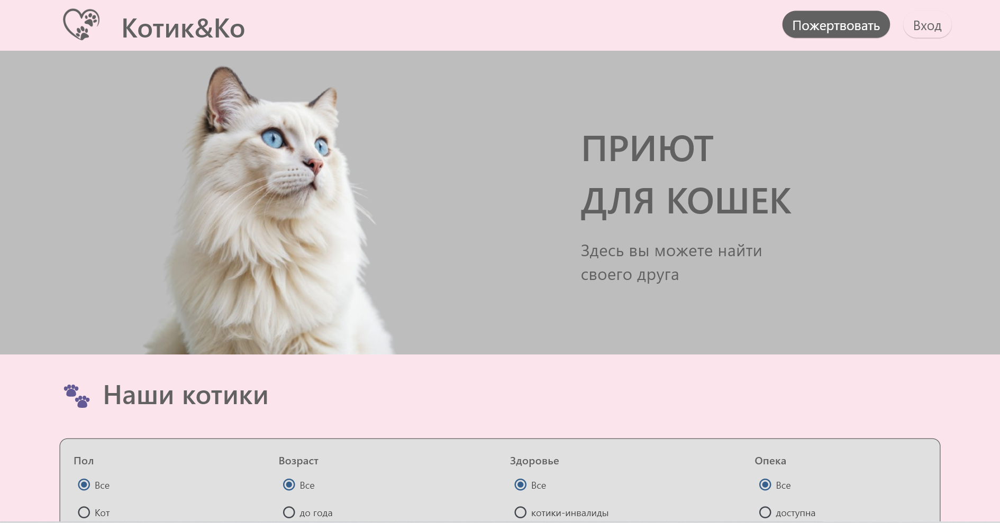
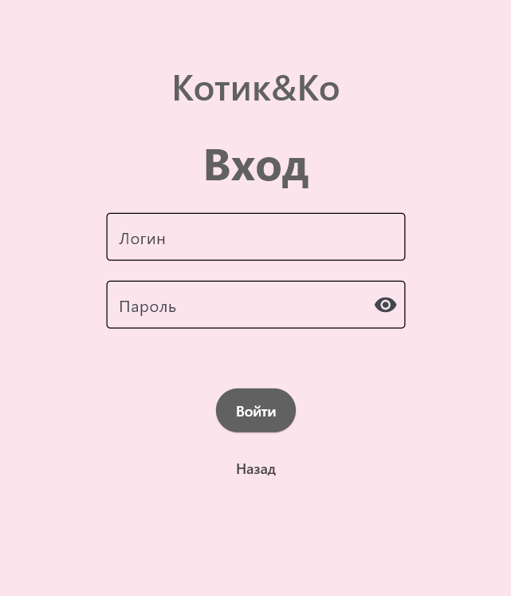

# 🐾 Animal Shelter App

**Animal Shelter App** — это десктопное приложение для приюта животных, разработанное с использованием Python и Flet. Приложение подключается к базе данных PostgreSQL и предоставляет полноценный интерфейс для сотрудников, директора, ветеринара и попечителей.

---

## Технологии

- 🐍 Python 3.11+
- 🎨 [Flet](https://flet.dev) — UI-фреймворк на Python
- 🐘 PostgreSQL — реляционная база данных
- 💳 Поддержка платежей (опека и пожертвования)
- 📁 Работа с изображениями и фильтрацией

---

## Основные функции

-  Авторизация по ролям:
  - **Директор**: управление животными, задачами и сотрудниками
  - **Сотрудник**: выполнение задач, редактирование животных
  - **Ветеринар**: просмотр и редактирование медицинских данных
  - **Попечитель**: оформление опеки и пожертвований

 

-  Работа с карточками животных:
  - Фото, описание, пол, здоровье, дата поступления
  - Фильтрация по полу, возрасту, статусу здоровья и др.

-  Панель задач:
  - Назначение, просмотр, выполнение задач (активные/завершенные)

---

